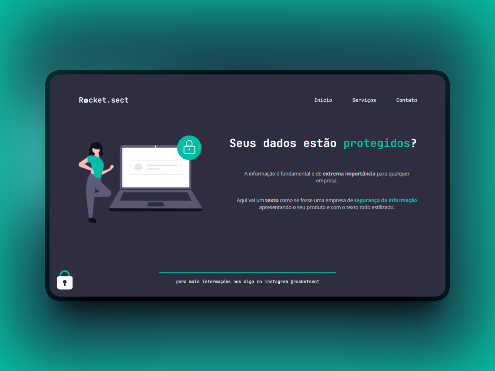

<h1 align="center"> Rocket.sect </h1>

  <a href="#-tecnologias">Tecnologias</a>&nbsp;&nbsp;&nbsp;|&nbsp;&nbsp;&nbsp;
  <a href="#-projeto">Projeto</a>&nbsp;&nbsp;&nbsp;|&nbsp;&nbsp;&nbsp;
  <a href="#-layout">Layout</a>&nbsp;&nbsp;&nbsp;&nbsp;&nbsp;&nbsp;

 

  

## 🚀 Tecnologias

Esse projeto foi desenvolvido com as seguintes tecnologias:

- HTML e CSS
- Git e Github
- Figma

## 💻 Projeto

Neste projeto Rocketseat foi feito uma Land page com o tema "Rocket.sect" uma landpage de uma empresa de segurança para desktop, com o intuito de estudar fundamentos do HTML e CSS, onde, foi desafiado a reprodução de um layout pelo figma com os conceitos aprendidos em aula, além de, uma resolução de código quebrado para testar nossos conhecimentos. Espero que gostem!

- [Acesse o projeto finalizado, online](https://luriserdan.github.io/Rocket-sect/)

## 🔖 Layout

Você pode visualizar o layout do projeto através [DESSE LINK](https://www.figma.com/design/ElgujNMv4Uasu3R9J5MpSC/Explorer-(Copy)?node-id=0-1&t=hz3rEq8Ny7Ckv11z-0). É necessário ter conta no [Figma](https://figma.com) para acessá-lo.

Feito com ♥ by Luri Serdan